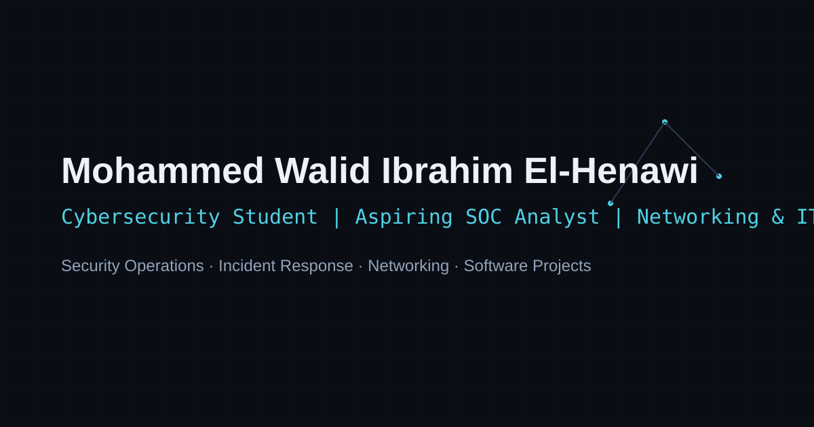

# Mohammed El-Henawi — Cybersecurity & SOC Portfolio

A professional portfolio for **Mohammed Walid Ibrahim El-Henawi**, a Cybersecurity student at Arab
Open University building toward Security Operations, Incident Response, and Networking/IT roles.

**Live Demo:** https://heno26.github.io/portfolio/
**Repository:** https://github.com/heno26/portfolio



---

## Purpose

This site exists to help cybersecurity, SOC/IR, and networking recruiters (and technical hiring
managers) understand within seconds that Mohammed is a credible, actively-training candidate with
real technical projects — not a generic student template or a "hacker aesthetic" landing page.

## Candidate Positioning

The site deliberately orders Mohammed's identity as:

1. **Cybersecurity** (degree, fundamentals)
2. **SOC / Incident Response** (DEPI training, target role)
3. **Networking / IT** (CCNA in progress, Packet Tracer labs)
4. **Software development** — a complementary technical strength, not the headline

No claims of professional SOC employment, production security experience, completed
certifications, or a verified live Supabase backend are made anywhere on the site. Anything not
yet finished (labs, certifications, the CV file) is labeled honestly — "In Progress," "Planned
Lab," "Coming Soon" — rather than faked.

## Features

- Sticky, accessible navbar with active-section highlighting and a keyboard-friendly mobile menu
- Hero with a decorative, restrained SOC network-topology SVG (fully static — no fake live
  telemetry)
- Career Focus cards, categorized Skills (no fake percentage bars), and a project-progression
  story (Vanilla JS → React → full-stack → security labs)
- Featured Projects with category filtering (All / Cybersecurity / Networking / Web Applications)
  and an expandable case study per project
- Cybersecurity & Networking Labs section with honest status chips (Available / Planned)
- Education, Training, Technical Journey, and Currently Learning sections
- Contact section using real `mailto:`/`tel:`/external links — no fake "message sent" form
- Dark theme by default with a persisted light-mode toggle
- `prefers-reduced-motion` respected throughout

## Sections

Home (Hero) · About · Career Focus · Skills · Featured Projects · Cybersecurity & Networking Labs
· Education · Training & Technical Journey · Contact · Footer

## Tech Stack

- **React 19** + **Vite 8**
- **React Router 7** (`HashRouter` — see [GitHub Pages Notes](#github-pages-notes))
- **lucide-react** for icons (plus two small hand-rolled SVG icons for GitHub/LinkedIn, which
  lucide-react no longer ships)
- Hand-written CSS design system (CSS custom properties, no UI framework)
- **Vitest** + **React Testing Library** for tests
- **oxlint** for linting

No backend is required. No API keys or secrets are used anywhere in this project.

## Project Structure

```text
portfolio/
├── .github/workflows/deploy.yml   # GitHub Pages CI/CD
├── public/                        # Static assets served at the site root
│   ├── favicon.svg
│   ├── og-image.svg
│   ├── robots.txt
│   ├── sitemap.xml
│   └── site.webmanifest
├── src/
│   ├── app/                       # App.jsx + router.jsx (HashRouter)
│   ├── components/
│   │   ├── common/                # StatusChip
│   │   ├── layout/                # Navbar, Footer
│   │   └── ui/                    # Button, Badge, SectionHeading, brand icons
│   ├── data/                      # Centralized content — edit these to update the site
│   │   ├── profile.js
│   │   ├── focus.js
│   │   ├── skills.js
│   │   ├── projects.js
│   │   ├── labs.js
│   │   └── education.js
│   ├── hooks/                     # useTheme, useActiveSection
│   ├── pages/                     # HomePage, NotFoundPage
│   ├── sections/                  # One folder per homepage section
│   ├── styles/                    # tokens.css (design tokens), global.css
│   ├── utils/cv.js                # CV download href logic
│   └── __tests__/
├── index.html
├── vite.config.js
└── package.json
```

## Local Setup

```bash
npm install
npm run dev
```

The dev server runs at `http://localhost:5173/`.

## Build

```bash
npm run build      # outputs to /dist
npm run preview    # serve the production build locally
```

## Test & Lint

```bash
npm run test        # Vitest (data integrity, component, and routing tests)
npm run lint         # oxlint
```

## Deployment

Deployment is automated via `.github/workflows/deploy.yml` using the official
`actions/configure-pages`, `actions/upload-pages-artifact`, and `actions/deploy-pages` actions.
It builds on every push to `main` (and supports manual `workflow_dispatch`), runs tests, then
builds and deploys `/dist` to GitHub Pages.

To enable it on a fresh repository: push to `main`, then enable **GitHub Pages → Source: GitHub
Actions** in the repository settings once.

### GitHub Pages Notes

- `vite.config.js` sets `base: "/portfolio/"` to match the expected deployment URL
  `https://heno26.github.io/portfolio/`. If you fork this under a different repository name,
  update `base` to match.
- Routing uses **`HashRouter`** rather than `BrowserRouter`. GitHub Pages serves static files with
  no server-side rewrite rules, so a `BrowserRouter` would 404 on page refresh or on any direct
  link other than `/`. `HashRouter` keeps all routing client-side (URLs look like `/#/`), which
  works reliably with zero extra GitHub Pages configuration and no risk of a broken deep link.
  Currently the site is a single route (`/`) with a `*` 404 fallback, so this mainly future-proofs
  the project for `/projects/:slug` style routes later.

## Customizing Candidate Data

All personal/candidate content lives in `src/data/*.js`. Nothing is hard-coded across multiple
components — update the relevant data file and it propagates everywhere:

- `profile.js` — name, title, contact info, hero/about copy, CV filename
- `focus.js` — Career Focus cards
- `skills.js` — categorized skill chips
- `projects.js` — Featured Projects + case study content
- `labs.js` — Cybersecurity & Networking Labs
- `education.js` — Education, Training, Technical Journey, Currently Learning

## Adding New Projects or Labs

- **Projects:** add an object to the `projects` array in `src/data/projects.js`. Required fields:
  `slug`, `name`, `tagline`, `category` (must be one of `projectCategories`), `badges`, `purpose`,
  `highlights`, `stack`. `demoUrl`/`githubUrl` are optional — omit and set `labDocsComingSoon: true`
  for an honest "coming soon" state instead of a dead or fake link. `caseStudy` is optional and
  drives the expandable case-study panel.
- **Labs:** add an object to `labCategories` in `src/data/labs.js` with a `status` of
  `"available"`, `"in-progress"`, or `"planned"`.

## CV Setup

The Download CV button expects a real PDF at:

```text
/public/Mohammed_Walid_El_Henawi_CV.pdf
```

**This file has not been supplied**, so `profile.cvAvailable` in `src/data/profile.js` is set to
`false` and every "Download CV" button renders in a disabled state — it does not link to a missing
or fake file. To enable it:

1. Drop the real PDF into `/public/Mohammed_Walid_El_Henawi_CV.pdf`
2. Set `cvAvailable: true` in `src/data/profile.js`

No other code changes are needed — `src/utils/cv.js` handles the GitHub Pages base path
automatically via `import.meta.env.BASE_URL`.

## Accessibility

Implemented and manually verified in code:

- Semantic HTML and a logical heading order (single `h1` in the Hero, `h2` per section, `h3`/`h4`
  within cards)
- A "Skip to main content" link as the first focusable element
- Full keyboard navigation, including the mobile menu (Escape closes it, focus returns to the
  toggle button, body scroll is locked while open)
- Visible focus states everywhere (`:focus-visible`, never suppressed)
- `aria-current="true"` on the active nav link, `aria-expanded`/`aria-controls` on the mobile menu
  toggle and case-study toggles
- No icon-only buttons without an `aria-label`; all external links are labeled as opening in a new
  tab
- `prefers-reduced-motion: reduce` disables all animation/transition durations globally, plus the
  Hero's pulse animation specifically
- Decorative SVGs (Hero network graphic) carry `aria-label` describing them as decorative rather
  than being marked purely `aria-hidden` where they're the only visual content of the section

What was **not** independently verified: an automated axe/Lighthouse accessibility audit or a
screen-reader pass. These are recommended as a next step (see below).

## Performance

- No backend calls, no analytics scripts, no large dependencies beyond React/React Router/
  lucide-react
- Production bundle: ~276 KB JS / ~87 KB gzipped, ~26 KB CSS / ~5 KB gzipped (measured via
  `npm run build`)
- All project preview art is CSS/SVG — no images to optimize or that could cause layout shift
- Animations are limited to a slow hero pulse, hover states, and nav underlines

A full Lighthouse run was not performed in this environment (no browser automation available); the
bundle size and absence of blocking network calls make a strong score likely, but this should be
verified after deployment.

## Honest Limitations

Read this section before presenting the project — it is intentionally candid, per the "No Fake
Data" rule this project was built under:

- **CV file is not included.** The Download CV button is disabled everywhere until a real PDF is
  added (see [CV Setup](#cv-setup)).
- **ServiceFlow's public demo runs in Demo Mode.** The repository includes a full Supabase/
  PostgreSQL backend architecture, but it has not been verified against a live production project.
  The site says this explicitly in both the project card and case study.
- **Most Cybersecurity & Networking Labs are planned, not completed.** Only "Network Engineering"
  (the existing Packet Tracer work) is marked available; Traffic Analysis, Reconnaissance, SOC
  Investigation, and Incident Response labs are labeled "Planned Lab."
- **No downloadable `.pkt` files or certificate images exist yet.** The Network Labs project shows
  a disabled "Lab documentation coming soon" state instead of a fake link.
- **No automated Lighthouse/axe accessibility audit was run** in this build environment (no
  headless browser available). Manual accessibility practices were followed throughout, but an
  automated audit is recommended before final submission.
- **Case studies live as expandable panels on the homepage**, not separate `/projects/:slug`
  routes. The spec allowed this as optional; a single-page approach was chosen to keep the site
  fast and to avoid any GitHub Pages routing edge cases for now. The router is already in place
  (`HashRouter` + a 404 fallback) if dedicated routes are wanted later.
- **Manual responsive review** was done via the CSS breakpoints and grid behavior at each target
  width (see the QA section of the final report), not by rendering the app in a real browser at
  each viewport, since browser automation was unavailable in this environment.

## License

This project is a personal portfolio. All source code is provided as-is for Mohammed El-Henawi's
personal use.

## Author

**Mohammed Walid Ibrahim El-Henawi**
Cairo, Egypt
Email: mohammedelhenawi2@gmail.com
LinkedIn: https://www.linkedin.com/in/mohammed-el-henawi-2626602bb
GitHub: https://github.com/heno26
